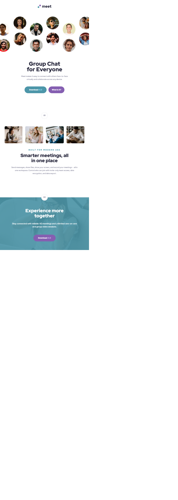

# Frontend Mentor - Meet landing page solution

This is a solution to the [Meet landing page challenge on Frontend Mentor](https://www.frontendmentor.io/challenges/meet-landing-page-rbTDS6OUR). Frontend Mentor challenges help you improve your coding skills by building realistic projects. 

## Table of contents

- [Overview](#overview)
  - [The challenge](#the-challenge)
  - [Screenshot](#screenshot)
  - [Links](#links)
- [My process](#my-process)
  - [Built with](#built-with)
  - [What I learned](#what-i-learned)
  - [Continued development](#continued-development)
- [Author](#author)
- [Project setup](#project-setup)

**Note: Delete this note and update the table of contents based on what sections you keep.**

## Overview

### The challenge

Users should be able to:

- View the optimal layout depending on their device's screen size
- See hover states for interactive elements

### Screenshot

#### Desktop

#### Tablet

#### Mobile

### Links

- Live Site URL: [Vercel](https://meet-landing-page-topaz.vercel.app/)

## My process

### Built with

- Semantic HTML5 markup
- CSS Grid
- Mobile-first workflow
- [Vue](https://vuejs.org/) - JS library

### What I learned

I learned some ways to manipulate backgrounds in combination with :after and :before pseudo elements to visualize

```css
  .hero {
    position: relative;
  }

  .hero:before {
    content: '';
    display: block;
    position: relative;
    background-image: url('../../assets/tablet/image-hero.png');
    background-repeat: no-repeat;
    background-position: center;
    background-size: 110.4%;
    left: -50%;
    transform: translateX(50%);
    height: 40.8vw;
    width: 100%;
    margin-bottom: 3rem;
    overflow-x: hidden;
  }

  @media only screen and (min-width: 768px) {
    .hero:before {
      background-size: 106.4%;
      margin-bottom: 4.5rem;
    }
  }

  @media only screen and (min-width: 1440px) {
    .hero:before {
      position: absolute;
      background-image: url('../../assets/desktop/image-hero-left.png');
      background-size: contain;
      background-position: -2rem;
      transform: none;
      left: 0rem;
      top: -50px;
      height: 303px;
      width: 33%;
    }

    .hero:after {
      overflow-x: hidden;
      content: '';
      position: absolute;
      background-image: url('../../assets/desktop/image-hero-right.png');
      background-size: contain;
      background-repeat: no-repeat;
      background-position: calc(100% + 2rem);
      transform: none;
      right: 0rem;
      bottom: 9px;
      height: 303px;
      width: 33%;
    }
  }
```

Further, I really like the way you can separate content from the Markup in Vue.


```js
export default defineComponent({
    name: 'App',
    components: {
      HeroSection,
      BrandLogo,
      LandingSection,
      CTAButton,
      CopyOverline,
      CopyHeading,
      CopySubHeading,
      CopyBody,
      GalleryGrid,
      GalleryImage,
      CTASubLabel,
    },
    data: () => {
      return {
        hero: {
          headline: 'Group Chat\nfor Everyone',
          copyHero:
            'Meet makes it easy to connect with others face-to-face virtually and collaborate across any device.',
        },
        main: {
          womanInVideoCall: require('@/assets/desktop/image-woman-in-videocall.jpg'),
          womenVideochatting: require('@/assets/desktop/image-women-videochatting.jpg'),
          menInMeeting: require('@/assets/desktop/image-men-in-meeting.jpg'),
          manTexting: require('@/assets/desktop/image-man-texting.jpg'),
          title: 'Smarter meetings, all in one place',
          overline: 'Built for modern use',
          copy: 'Send messages, share files, show your screen, and record your meetings — all in one workspace. Control who can join with invite-only team access, data encryption, and data export.',
        },
        footer: {
          title: 'Experience more together',
          copy: 'Stay connected with reliable HD meetings and unlimited one-on-one and group video sessions.',
        },
        download: {
          label: 'Download',
          subLabel: 'v1.3',
        },
        about: {
          label: 'What is it?',
        },
      }
    },
  })
```

This really leads to some nice templates and really modular code.

```xml
<template>
  <header>
    <BrandLogo />
    <HeroSection>
      <CopyHeading>{{ hero.headline }}</CopyHeading>
      <CopyBody>{{ hero.copyHero }}</CopyBody>
      <CTAButton>
        {{ download.label }}
        <CTASubLabel>
          {{ download.subLabel }}
        </CTASubLabel>
      </CTAButton>
      <CTAButton theme="secondary" padding="sm">{{ about.label }}</CTAButton>
    </HeroSection>
  </header>
  <main>
    <LandingSection>
      <GalleryGrid>
        <GalleryImage :src="main.womanInVideoCall" alt="" />
        <GalleryImage :src="main.womenVideochatting" alt="" />
        <GalleryImage :src="main.menInMeeting" alt="" />
        <GalleryImage :src="main.manTexting" alt="" />
      </GalleryGrid>
      <CopyOverline>{{ main.overline }}</CopyOverline>
      <CopySubHeading>{{ main.title }}</CopySubHeading>
      <CopyBody>{{ main.copy.replace('-', '&#8209;') }}</CopyBody>
    </LandingSection>
  </main>
  <footer>
    <LandingSection theme="dark" footer>
      <CopySubHeading theme="light">{{ footer.title }}</CopySubHeading>
      <CopyBody theme="light">{{ footer.copy }}</CopyBody>
      <CTAButton theme="secondary">
        {{ download.label }}
        <CTASubLabel>
          {{ download.subLabel }}
        </CTASubLabel>
      </CTAButton>
    </LandingSection>
  </footer>
</template>
```


### Continued development

I am tempted to use Vue more often. But I also need some more time to reflect on how to handle spacing with css and become more responsive without setting breakpoints all the way arount.

I really hope to become more faster with every exercise and building pages in a fracture of time to think more about user experience and API interactions in the future.

## Author

- Frontend Mentor - [@don_heidi](https://www.frontendmentor.io/profile/DonHeidi)


## Project setup
```
yarn install
```

### Compiles and hot-reloads for development
```
yarn serve
```

### Compiles and minifies for production
```
yarn build
```

### Lints and fixes files
```
yarn lint
```

### Customize configuration
See [Configuration Reference](https://cli.vuejs.org/config/).
